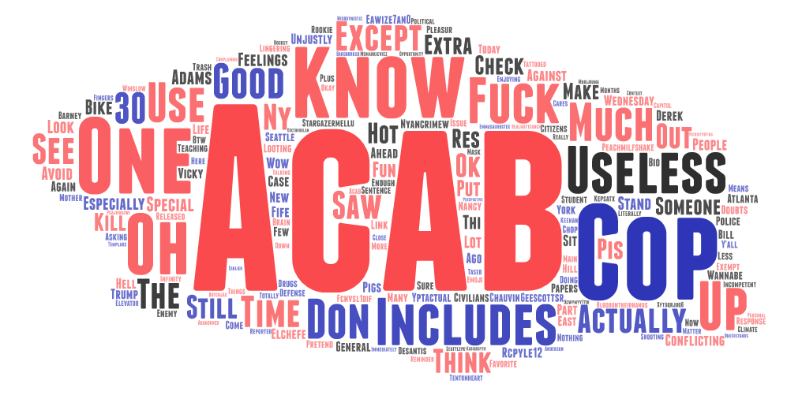
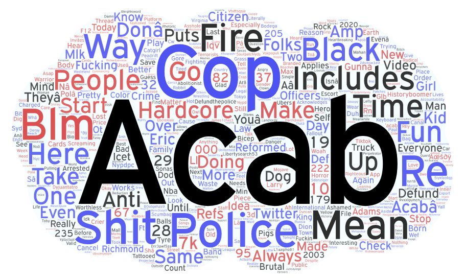

# geog458_lab2

## "ACAB" Word Clouds
### Seattle, WA:

[Seattle Data CSV File](https://drive.google.com/file/d/1--l7MX14SBeFOory1-9ronwDjX741x9I/view?usp=share_link)

### New York, NY:

[New York Data CSV File](https://drive.google.com/file/d/1-GDu1aYUjX5D4oev8_aACpqAKhSy9URK/view?usp=share_link)

## Research Narrative

The topic I chose for search was the term "ACAB", an acronym for the term "All Cops are Bastards". I thought this would be a good term to use as it is closely related to current national social movements and progressive policy. I chose the cities Seattle and New York because I usually think of them as decently comparable metropolitan areas. 

Both word clouds of course include the term ACAB, as all tweets pulled share that term. Another common thread between the two word cloud is negative descriptors such as "shit", "mean", "useless", and general explitives like "shit" and "fuck", showing that people tweeting ACAB have a general feeling that police are not serving their purpose in society. The common word that stands out to me is the word "includes", which confused me at first, but then I realized it stems from a pretty common phrase "ACAB, that includes your [family member]".

I was honestly a bit disappointed by the quantity of results I recieved when running the tweet crawler script, especially for the Seattle data. There would be a few ways to improve this issue with varying levels of realism. The least realistic (for me at least) would be to extend time range of tweets pulled. I say that's the least realistic option because my API keys do not allow for me to go back further than a week in the past. Another way to potentially improve the number of tweets I collect would be to collect tweets from a larger radius. It makes sense that a larger area would yield more tweets. The final idea I have for improving the number of tweets collected is to also collect tweets using closely related terms. For instance, I only collected tweets with the acronym "ACAB", but it is very possible I missed many relavant tweets using the fully spelled out "All Cops are Bastards". For some terms it may even be useful to include common misspellings of relavant search terms, depending on the term.